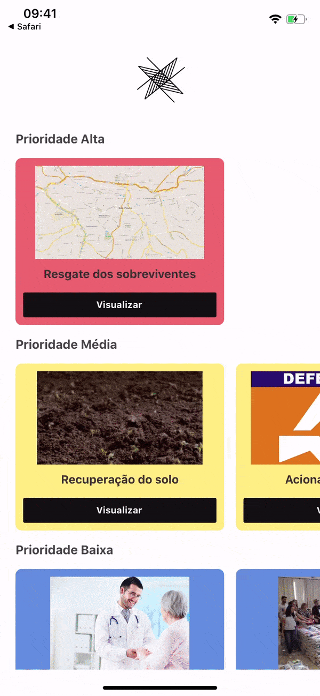

<h1 align="center">
    
</h1>

<h3 align="center">
NASA International Space Apps Challenge - Curitiba, 2019  
 
Equipe 11 
Gustavo Tatarem 
Janete Knapik 
Lucas Delaterra 
Luiz Matias 
Paola Barros Delben 
Ysis Emi Mori 
 
Desafio - From Curious Minds Come Helping Hands
</h3>

# Fractal #11

## Qual é o problema?

#### Desastres naturais
Os desastres naturais são furacões, erupções vulconicas, tsunamis, terremotos, etc. No projeto, utilizamos como ilustração o rompimento de barragens no Brasil. Há cerca de 24 mil barragens no país e apenas 3% dessas foram vistoriadas. Aproximadamente 4 milhões de pessoas estão sob o risco de serem afetadas por rompimentos.
Quando essas tragédias acontecem, o governo cria um gabinete de crise, reunindo especialistas para encontrar as melhores soluções, mas esse processo não é rápido e muitas vezes a emoção excede a razão. Esses momentos do gabinete são críticos para saberem quais medidas serão tomadas para prevenir, conter ou minimizar os danos e prejuízos do desastre iminente ou estabelecido.  Alguns dos passos do gabinete de crise são: identificar suas possíveis causas e suas prováveis consequências. O processo permite estabelecer um plano de ação, por exemplo, indicar quais os recursos necessários para atuar na situação.

## Qual a nossa missão?

#### Utilizar a tecnologia ao nosso favor!
Nosso papel é mostrar que podemos utilizar bases de dados de satélites, pesquisas e metodologias ágeis para prevenir que as consequências de um desastre natural sejam ainda piores. Nossa proposta é que os dados sejam utilizados para o apoio à tomada de decisões, reduzindo o tempo da análise da situação, ao trazer alternativas baseadas em estatística e probabilidade.

A solução que desenvolvemos propõe uma plataforma intuitiva para que o usuário acompanhe o fluxo de demandas prioritárias. Com isso, esperamos uma redução de danos e prejuízos, do impacto ambiental e a preservação das vidas.

Por exemplo, teremos mapas de concentração das vulnerabilidades, que permitirão localizar idosos, crianças e gestantes com eficácia. Também apresentaremos dados sobre recursos necessários, por exemplo: Quantos helicópteros, barcos, carros, aviões, quantos médicos, bombeiros, engenheiros, psicólogos, quanto e quais alimentos e remédios necessários.

## Estado atual do projeto

## Ideias em desenvolvimento

